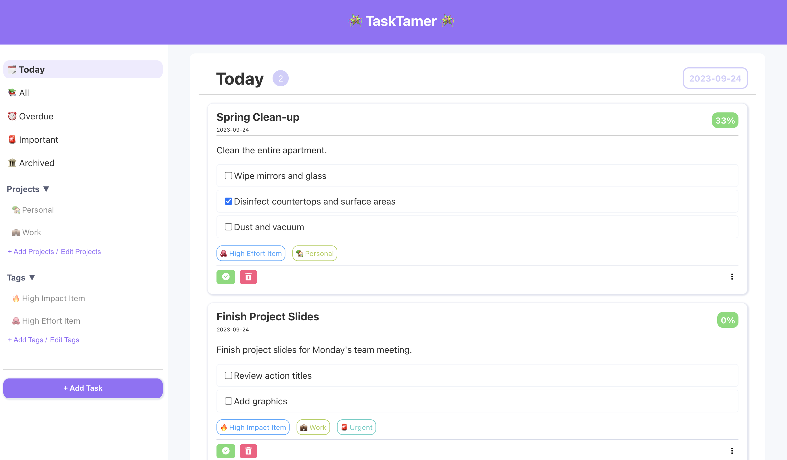

# TaskTamer 🚀

TaskTamer is a simple web application that allows you to create, edit, and manage tasks. 

   

## Features 

- **Add Tasks** 📝 : Create new tasks and add information such as the title, description, due date, priority level, tag, project, and subtasks.

- **Track Progress** ✅ : Manage the task progress by checking off subtasks and monitor your overall completion status.

- **Edit Tasks** ✏️ : Make changes to the task after it has been created.

- **Customize Lists** 🛠️ : Create custom projects/tags to organize and filter tasks.

- **Archive Completed Tasks** 🗃️ : Automatically archive your tasks by marking them as complete.

- **Delete Tasks** 🚮 : Permanently delete any unwanted tasks. 

 

## Getting Started 
1. Clone this repository to your local machine.
2. Install the required dependencies using `npm install`.
3. Start the development server with `npm start`.